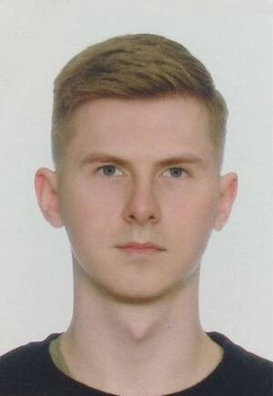
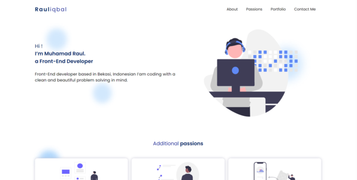
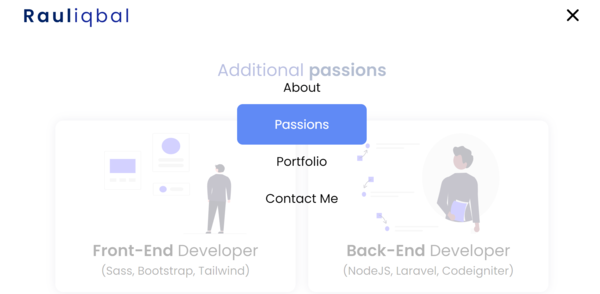
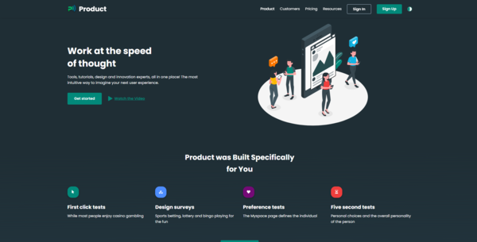
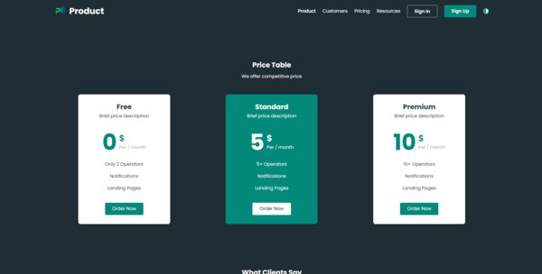
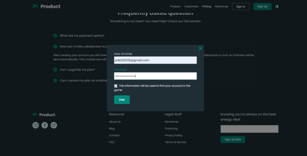
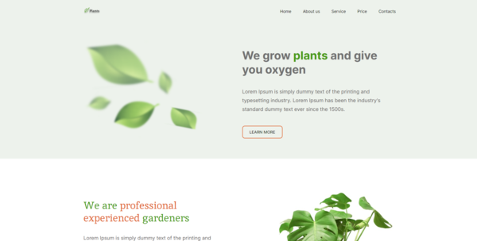
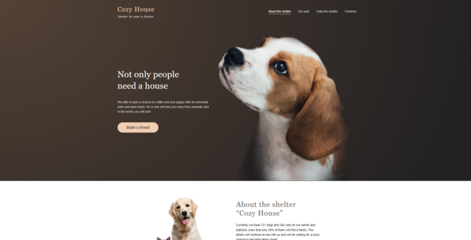
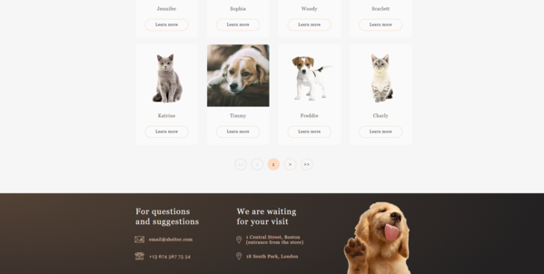
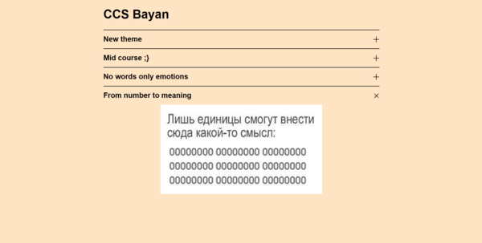

### [rsschool-cv](https://danil-27.github.io/rsschool-cv/)

## Danil Postovoy

### Contacts
##### Phone: +79892945710
##### Discord: danil_postovoy
##### Gmail: pde200126@gmail.com 
##### Telegram: https://t.me/Kolo_27

---

### About me
Postovoy Danil
The scope of my activity is the development of websites , which are an important element in the work of any business and society.
My goal is to develop and achieve success in the direction of Frontend development. Self-education , studying at courses and individual work with a mentor helps me to go to my goal.
To work in a company and in a team , I have such qualities as : flexibility , honesty , active and positive attitude , the ability to move , responsibility , communication skills and the desire to expand my skills

---

### Skills

- HTML
- CSS3
- SASS and SCSS 
- JavaScript
- Responsive design: Experience designing responsive websites that look great on various Mobile First and Desktop First devices, also using the CSS Grid Layout Tool, Pixel perfect.
- Web design: experience with figma, Photoshop
- Starting to use the Vue framework in my projects
- Experience with SEO Schema.org
- CodeWars - problem solving
- Cross-browser compatibility: deep understanding of the differences between different browsers and experience in creating compatible interfaces
- Web Performance: Optimize web pages to improve loading speed and improve user experience, used services such as PageSpeed ​​Insights
- Github: Experience with the Git version control system for collaborative development

---
### English language

###### Native language  - Russian
###### Level of English proficiency - B1

---
### Self-education
###### may 2022 – aug 2023

The most important thing that drives me is my interest and desire to learn new things , my self-education was based on documentation and books , as well as on various web resources.

### Working with a mentor
###### Github : [HelgaZhizhka](https://github.com/HelgaZhizhka)
###### aug 2022 –  may 2023

One of the main periods in my practice was the joint work with my mentor , who has extensive commercial experience in the field of web development of sites , HelgaZhizhka , thanks to her I have strong practical and theoretical knowledge , she also passed on the experience that creates a skill for direct work in a commercial company.

### Сourses from EPAM
###### The Rolling Scopes
###### jan 2023 – jun 2023

### Code examples
##### [codeWars](https://www.codewars.com/dashboard/discourse/all)

---

### My projects

##### [Rauliqbal-Github](https://github.com/Danil-27/Project-Rauliqbal) | [Rauliqbal-Deployment](https://project-rauliqbal.netlify.app) 
 

##### [Product-Github](https://github.com/Danil-27/Product) | [Product-Deployment](https://project-2-product.netlify.app)

.png)   

##### [Plants-Github](https://github.com/Danil-27/Plants) | [Plants-Deployment](https://clinquant-meringue-3eee66.netlify.app/)

##### [Shelter-Github](https://github.com/Danil-27/Shelter) | [Shelter-Deployment](https://rolling-scopes-school.github.io/danil-27-JSFE2023Q1/shelter/)

 

---

### Parts of blocks

##### [cssBayan-Github](https://github.com/Danil-27/cssBayan) | [ssBayan-Deployment](https://danil-27.github.io/cssBayan/cssBayan/index.html)

